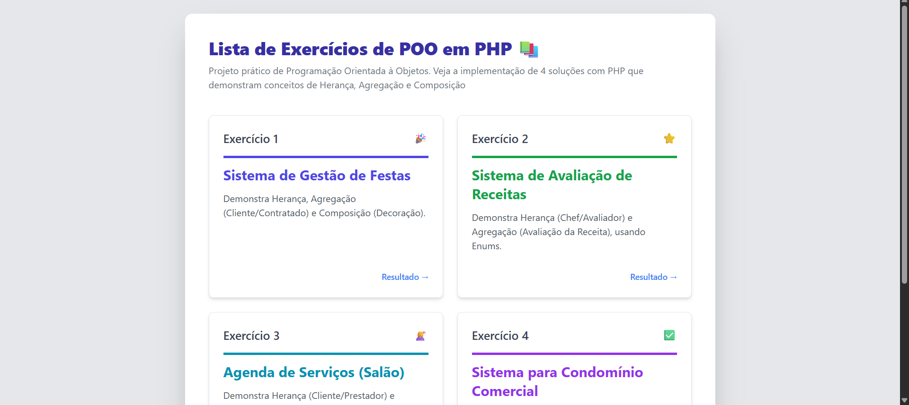
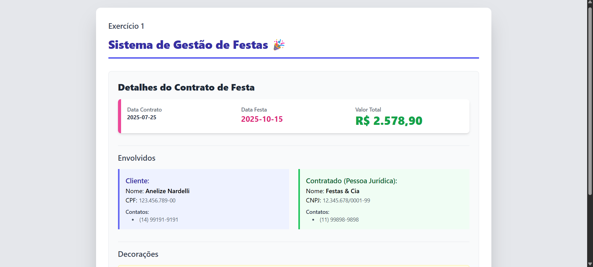

# Técnicas de Programação com PHP

## 📚 Lista de Exercícios de Programação Orientada a Objetos em PHP

> Esta seção do repositório contém as soluções para uma série de **4 exercícios práticos** focados na consolidação dos pilares da Orientação a Objetos utilizando a versão moderna do PHP.

### 🎯 Objetivo e Foco do Projeto
* **Interpretação:** Tradução de diagramas de classe UML em código PHP funcional, garantindo que os objetos sejam instanciados corretamente e exibidos de forma estruturada.
* **Padrão de Qualidade:** Implementação com tipagem estrita, getters e setters para encapsulamento, e o método mágico `__toString()` para formatação de saída.
* **Apresentação:** Exibição dos dados utiliza com Heredoc para HTML, formatado com Tailwind CSS (via CDN) para um visual limpo e profissional.

### 🗝️ Conceitos Chave de POO Aplicados
* **Herança:** Criação de classes especializadas a partir de uma classe abstrata genérica.
* **Agregação:** Relacionamentos onde o objeto "pai" utiliza instâncias de outros objetos, mas não depende deles para existir.
* **Composição:** Relacionamentos de forte dependência onde a parte pertence exclusivamente ao todo.
* **Encapsulamento:** Uso de atributos privados e protegidos, acessados e modificados unicamente via Getters e Setters.

### 🚀 Como Executar o Projeto

1.  **Configure o ambiente:** Instale e configure o **XAMPP**, **WAMP** ou **Laragon** em sua máquina.
2.  **Clone o Repositório:**
```bash
git clone https://github.com/N4rdelli/tecnicas-de-programacao-i.git
```
3.  **Localize a pasta:** Mova este diretório do projeto clonado (`LEPOO-AnelizeNardelli`) para o diretório de documentos do seu servidor (ex: `C:\xampp\htdocs`).
4.  **Acesse o Menu:** Abra seu navegador e acesse o endereço do servidor seguido pelo nome da pasta do projeto:
```
http://localhost/LEPOO-AnelizeNardelli/index.php
```

### 📸 Capturas de Tela
**Menu Inicial**



**Exercício 1: Sistema de Gestão de Festas**


